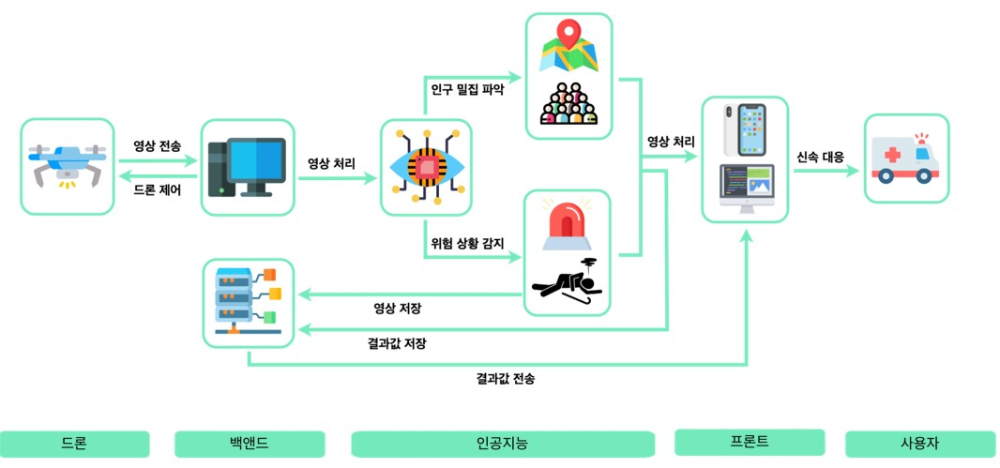
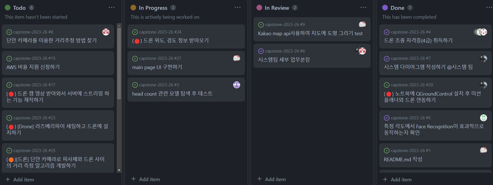

# DITTO: Drone Is Tracking Twenty-four-seven Ours

  
  
  
  
  
  
  
  
  

  

## 목차

1. [🤖 프로젝트 소개](#-프로젝트-소개)

2. [💻 주요 기능](#-주요-기능)

3. [🎥 데모 영상](#-데모-영상)

4. [💁🏻 팀원 소개](#-팀원-소개)

5. [🎨 프로젝트 구조](#-프로젝트-구조)

6. [🔨 작업 방식](#-작업-방식)

7. [✨ 기대 효과](#-기대-효과)

8. [🔑 관련 문서](#-관련-문서)

  

## 🤖 프로젝트 소개

<code>드론을 활용한 야외 인구 밀집도 및 위험 감지 서비스</code>
 

대규모 야외 행사에서 드론을 활용하여 측정한 인구 밀집도를 지도에 표시함으로써 사고를 예방합니다. 넓은 시야를 가진 드론을 통해 쓰러짐, 폭행 등의 위험 상황을 빠르게 감지하고 사용자들에게 알립니다. 사용자는 붐비고 위험한 구역을 피해 안전하게 야외 행사를 즐길 수 있습니다. 시민들의 안전하고 즐거운 야외활동에 DITTO가 함께합니다 :) 

  

## 💻 주요 기능

 <code>드론 자율 주행 </code>
  

 행사장을 특정 시간 단위로 순회하며 야외임에도 불구하고 사각지대 없이 모든 영역을 관제합니다
  
  

 <code>인공지능을 활용한 인구 밀집도 계산</code>
  

 드론을 통해 받아온 영상에서 사람 수를 알아내고 해당 면적에 대한 밀집도를 계산합니다. 1m^2당 6명 이상의 사람이 있다면 혼잡, 2-3명 사이라면 적정 등으로 분류합니다. 
  
  

 <code>인공지능을 활용한 pose recognition </code>
  

 Pose recognition이라는 기술을 활용하여 드론에서 받아온 영상에서 쓰러짐, 폭행 등 위험 상황을 감지하여 사용자들에게 알립니다.
  
  

 <code>인구 밀집도 지도 </code>
  

 계산된 인구 밀집도를 사용자가 편안하게 볼 수 있도록 지도에 분류된 색상으로 표시합니다. 사용자는 이를 통해 혼잡한 곳은 피하며 사고를 예방하고 안전하게 야외활동을 즐길 수 있습니다.  

  

## 🎥 데모 영상

  

## 💁🏻 팀원 소개

 

|                                                       [강윤석](https://github.com/YunSeok-Kang)                                                      |                                                      [권소예](https://github.com/soyekwon)                                                     |                                                       [박민준](https://github.com/mjun4138)                                                    |
| :--------------------------------------------------------------------------------------------------------------: | :--------------------------------------------------------------------------------------------------------------: | :--------------------------------------------------------------------------------------------------------------: |
|  | |  |
|                                                🧑🏻‍💻 학번: xxxx3082                                                 |                                                👩🏻‍💻 학번: xxxx1552                                                 |                                                👩🏻‍💻 학번: xxxx1611                                                 |
|                                      📌 Role:                                      |                                       📌 Role:                                         |                                       📌 Role:                                         |
|                                             📧 Email: ysck73@kookmin.ac.kr                                           |                                             📧 Email: soye0710@kookmin.ac.kr                                          |                                             📧 Email: pmj4138@kookmin.ac.kr                                          |

 

|                                                       [서정현](https://github.com/junghyeon0427)                                                      |                                                      [이재원](https://github.com/ljwljy51)                                                    |                                                       [조현아](https://github.com/hacho08)                                                 |
| :--------------------------------------------------------------------------------------------------------------: | :--------------------------------------------------------------------------------------------------------------: | :--------------------------------------------------------------------------------------------------------------: |
|  | |  |
|                                                🧑🏻‍💻 학번: xxxx1383                                                 |                                                👩🏻‍💻 학번: xxxx0498                                                 |                                                👩🏻‍💻 학번: xxxx2912                                                 |
|                                      📌 Role:                                      |                                       📌 Role:                                         |                                       📌 Role:                                         |
|                                             📧 Email: jh04270312@kookmin.ac.kr                                          |                                             📧 Email: ljwljy51@kookmin.ac.kr                                          |                                             📧 Email:  chcho0819@kookmin.ac.kr                                          |

  

## 🎨 프로젝트 구조 

 

  

## 🔨 작업 방식
github의 issue와 pull request기능을 적극 활용해 프로젝트 작업 진행 

  

## ✨ 기대 효과

<code>실시간으로 인구밀집도 및 위험 상황 감지 가능 </code>
  
 
기존의 관리자 중심 시스템과는 달리 시민들이 직접 인구 밀집도와 위험여부를 파악할 수 있습니다. 
 
 

<code>사각지대 OUT </code>
  
 
자율주행 드론을 활용하여 기존 CCTV의 한계점이었던 사각지대를 극복할 수 있습니다.
 
 

<code>단발성 CCTV </code>
  
 
야외행사의 특징에 맞게 시간과 장소에 구애받지 않고 CCTV 설치와 철거가 불필요합니다.

## 🔑 관련 문서

### [중간 발표 자료](docs/팀26조-중간발표자료.pdf)
### [중간 보고서](docs/팀26조-중간보고서.pdf)  
### [시연 동영상](docs/팀26조-시연동영상.pdf) 
### [포스터](docs/팀26조-포스터.pdf)  
### [최종 발표 자료] 
### [결과 보고서]