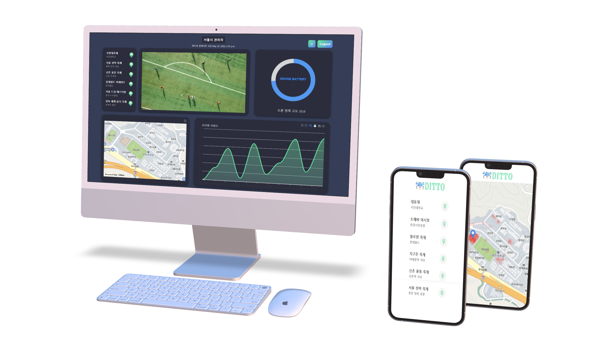
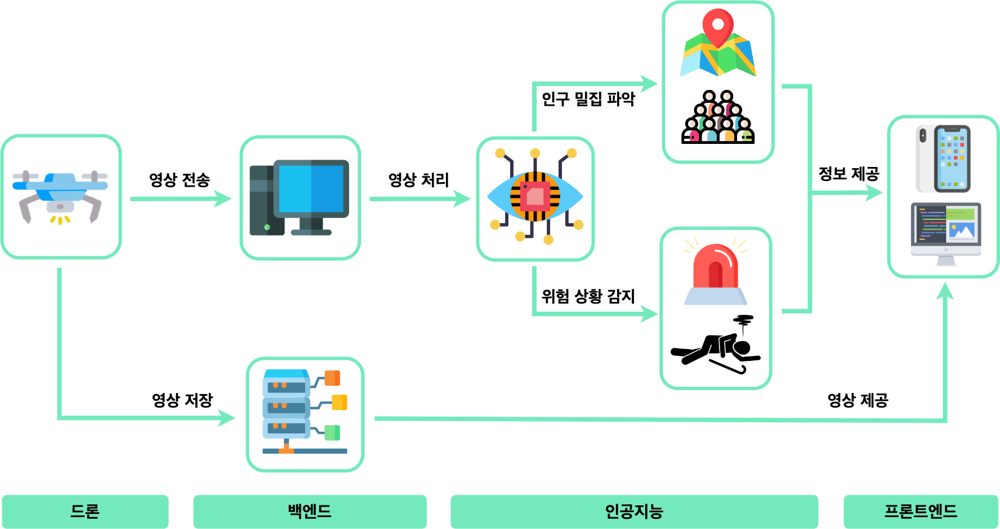
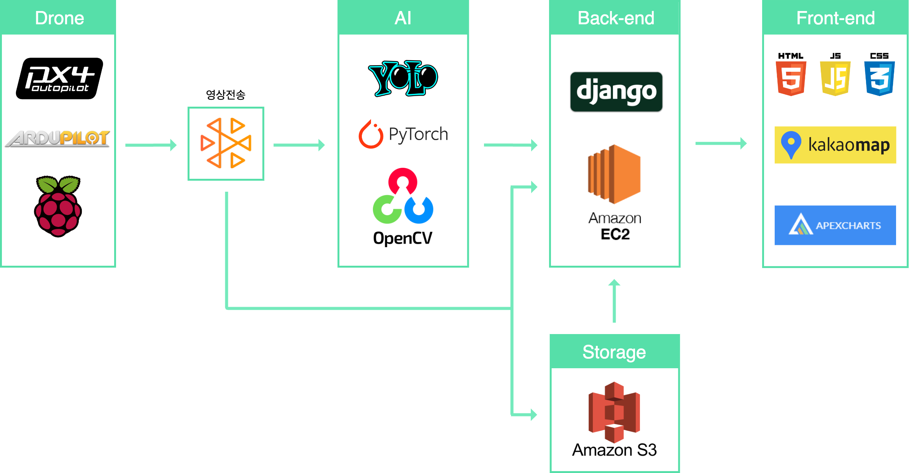

# DITTO: Drone Is Tracking Twenty-four-seven Ours


<div align=center>
  
  
  
  
  
  
  
  
</div>

<br/><br/>

## 목차

1. [🤖 프로젝트 소개](#-프로젝트-소개)

2. [💻 주요 기능](#-주요-기능)

3. [🎥 소개 영상](#-데모-영상)

4. [💁🏻 팀원 소개](#-팀원-소개)

5. [🎨 프로젝트 구조](#-프로젝트-구조)

6. [🔨 작업 방식](#-작업-방식)

7. [✨ 기대 효과](#-기대-효과)

8. [🔑 관련 문서](#-관련-문서)


<br/><br/>

## 🤖 프로젝트 소개



<code>드론을 활용한 야외 인구 밀집도 및 위험 감지 서비스</code>
<br/>

드론에 인공지능 기술을 적용하여 기존의 CCTV가 가지고 있는 여러 한계점을 해소하고 행사를 관리하는 관리자에게 원활한 인구 밀집 관제 서비스를 제공하는 것이 목표입니다. 드론의 카메라를 통해 촬영된 영상에 인공지능 기술을 적용하여 사람이 얼마나 밀집해 있는지를 파악하고 해당 정보는 관리자와 일반 시민들에게 보여지게 됩니다. 관리자는 추가적으로 드론의 배터리 상태와 같은 드론의 추가 정보, 실시간 촬영 영상 등에 접근이 가능하며 효과적인 관제가 가능하도록 합니다. 일반 시민들은 지도 상에 얼마만큼의 인구가 밀집해 있는지를 확인 가능하며 이로 인해 좀 더 안전한 야외활동을 즐길 수 있도록 하는 것이 우리의 목표입니다. <br/>시민들의 안전하고 즐거운 야외활동에 DITTO가 함께합니다 :) 

<br/><br/>

## 💻 주요 기능

 <code>드론 자율 주행 </code>
 <br/>

 행사장을 특정 시간 단위로 순회하며 야외임에도 불구하고 사각지대 없이 모든 영역을 관제합니다
 <br/>
 <br/>

 <code>인공지능을 활용한 인구 밀집도 계산</code>
 <br/>

 드론을 통해 받아온 영상에서 사람 수를 알아내고 해당 면적에 대한 밀집도를 계산합니다. 5m^2당 30명 이상의 사람이 있다면 혼잡, 10-20명 사이라면 적정 등으로 분류합니다. 
 <br/>
 <br/>

 <code>인공지능을 활용한 pose estimation </code>
 <br/>

 Pose estimation이라는 기술을 활용하여 드론에서 받아온 영상에서 쓰러짐과 같은 위험 상황을 감지하여 사용자들에게 알립니다.
 <br/>
 <br/>

 <code>인구 밀집도 지도 </code>
 <br/>

 계산된 인구 밀집도를 사용자가 편안하게 볼 수 있도록 지도에 빨간색 원의 투명도를 다르게하여 표시합니다. 사용자는 이를 통해 혼잡한 곳은 피하며 사고를 예방하고 안전하게 야외활동을 즐길 수 있습니다.  

<br/><br/>

## 🎥 소개 영상
[](https://youtu.be/xVOopTkpRfs)

<br/><br/>

## 💁🏻 팀원 소개


```
😀 이름 : 강윤석
🧑🏻‍💻 학번 : xxxx3082
📧 이메일 : ysck73@kookmin.ac.kr

📌 역할 : 
    - 
    - 
```


```
😀 이름 : 권소예
🧑🏻‍💻 학번 : xxxx1552
📧 이메일 : soye0710@kookmin.ac.kr

📌 역할 : Front-end
    - UI/UX 디자인 및 개발
    - git 관리
```


```
😀 이름 : 박민준
🧑🏻‍💻 학번 : xxxx1611
📧 이메일 : pmj4138@kookmin.ac.kr

📌 역할 : Back-end
    - 
    - 
```


```
😀 이름 : 서정현
🧑🏻‍💻 학번 : xxxx1383
📧 이메일 : jh04270312@kookmin.ac.kr

📌 역할 : AI
    - 
    - 
```


```
😀 이름 : 이재원
🧑🏻‍💻 학번 : xxxx0498
📧 이메일 : ljwljy51@kookmin.ac.kr

📌 역할 : AI
    - HeadCount 모델 구축 및 학습
    - 
```


```
😀 이름 : 조현아
🧑🏻‍💻 학번 : xxxx2912
📧 이메일 : chcho0819@kookmin.ac.kr

📌 역할 : PM, Back-end
    - 
    - 
```

<br/><br/>

## 🎨 프로젝트 구조 


<code> 프로젝트 흐름도 </code>  



<br/>


<code> 시스템 구조도 </code>  




<br/><br/>

## 🔨 작업 방식
github의 issue와 pull request기능을 활용해 프로젝트 작업 진행 

<br/>


<br/><br/>

## ✨ 기대 효과

<code>인공지능 기술을 적용하여 관제 인력 부족의 문제를 해결할 수 있습니다. </code>
 <br/>
 
실시간으로 영상을 계속해서 확인하려면 많은 인력이 필요한데 현재 관제 인력 부족의 문제가 존재합니다. 우리는 드론의 카메라에 인공지능 기술을 적용하여 이러한 인력 부족의 문제를 해결하고 이에 따라 관리자는 관리자 페이지에서 실시간 영상을 통해 인구 밀집 정도를 확인하고 위험한 상황이 발생한 경우에도 빠른 대처가 가능합니다.
<br/>
<br/>

<code>야외 행사마다 매번 CCTV를 설치하는 번거로움을 줄일 수 있습니다.</code>
 <br/>
 
야외 행사마다 안전한 행사를 위해 매번 CCTV를 설치하고 해체해야 한다는 번거로움이 존재했는데 이러한 CCTV의 역할을 드론을 통해 해결할 수 있습니다. 우리의 서비스를 이용하면 매번 CCTV를 설치하는데 추가적으로 들어가는 비용을 절감할 수 있습니다. 추가적으로 CCTV를 설치해야 할 때 필수적으로 고려해야하는 사각지대의 문제점을 드론을 통해 해결할 수 있습니다.
<br/>
<br/>

<code>축제를 즐기는 일반 시민들도 실시간으로 손쉽게 정보를 확인할 수 있습니다. </code>
 <br/>
 
기존의 관리자 중심의 관제 서비스로 인해 실시간 정보는 관리자만 확인이 가능했고 축제를 즐기는 일반 시민들은 인구 밀집 정보에 대한 확인이 쉽지 않다는 단점이 존재했었습니다. 이와 달리 우리는 시민들에게도 손쉽게 휴대폰으로 인구 밀집도가 표시된 지도를 확인할 수 있도록 서비스를 제공하여 안전한 행사를 즐길 수 있습니다.
<br/>
<br/>

<code>추후 활용 방안</code>
 <br/>
 
단순한 일회성의 서비스가 아닌 우리의 서비스를 우선 구축해 놓으면 반영구적으로 사용이 가능하다는 장점이 있습니다. 드론에 추가적인 인공지능 기술 등을 도입하여 인구 밀집도 파악 뿐만 아니라 교통 상황을 실시간으로 판단하는 드론 등과 같이 다양한 방면으로 목적에 맞게 이용이 가능하기 때문에 확장성 측면에서도 충분히 활용이 가능합니다.


<br/><br/>

## 🔑 관련 문서

### [중간 발표 자료](docs/팀26조-중간발표자료.pdf)
### [중간 보고서](docs/팀26조-중간보고서.pdf)  
### [시연 동영상](docs/팀26조-시연동영상.mp4) 
### [포스터](docs/팀26조-포스터.pdf)  
### [최종 발표 자료](docs/팀26조-최종발표자료.pdf) 
### [결과 보고서](docs/팀26조-결과보고서.pdf)